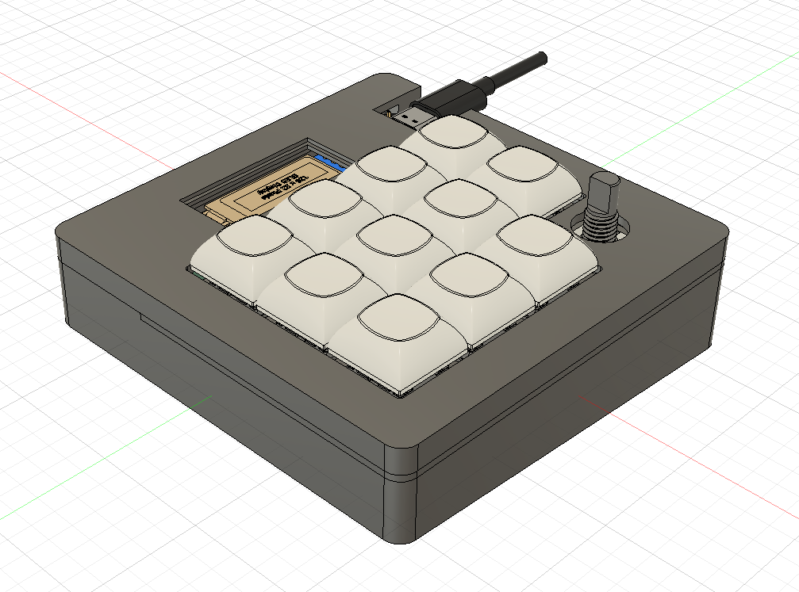
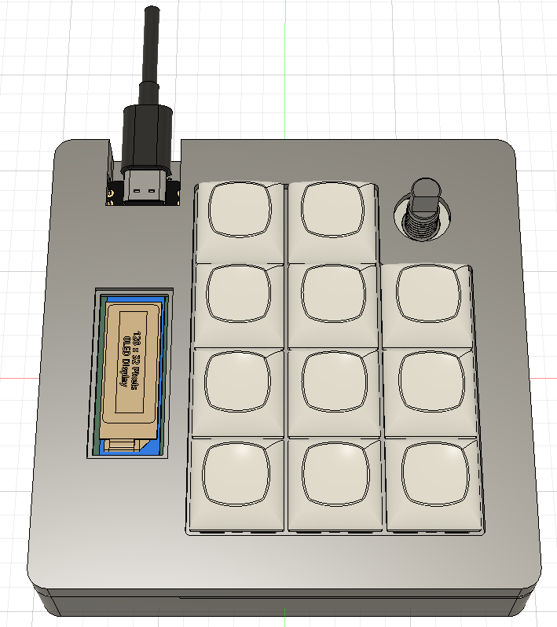
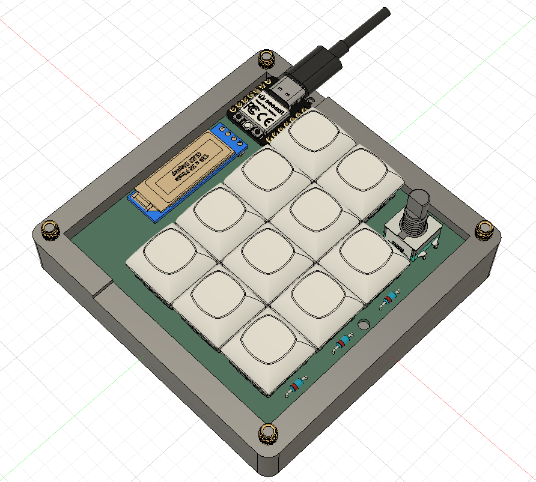
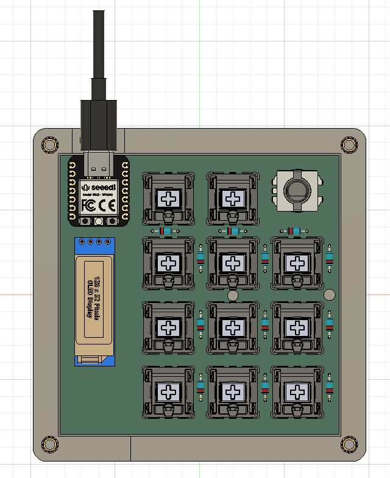
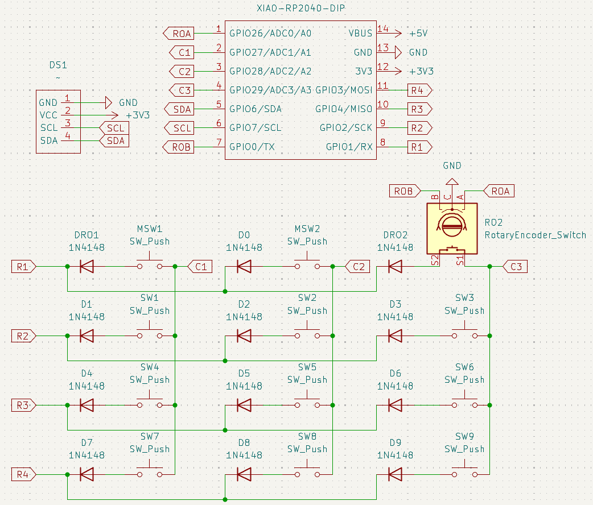
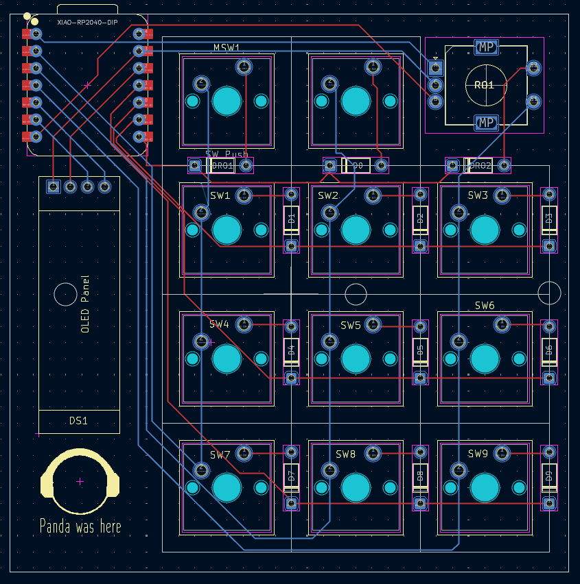

# Chauhan's Macropad
A macropad purpose built for me.
Built with Blueprint, Hackclub. It is a Macropad with 11 keys, a Rotary Encoder, 1 0.91 128x32 OLED and the SEEED XIAO RP2040.

### Images

### Specifications

BOM: 
- 10x Cherry MX Switches
- 1x XIAO RP2040
- 10x Blank DSA Keycaps
- 1x 0.91 128x32 OLED
- 2x EC11 Rotary Encoders
- 4x M3x16 Bolt
- 4x M3 Heatset

Others:
- KMK Firmware
- macpad_print_cover.stl
- macpad_print_plate.stl
- macpad_print_base.stl
- Custom PCB

Schematic            |  PCB
:-------------------------:|:-------------------------:|
     |        
